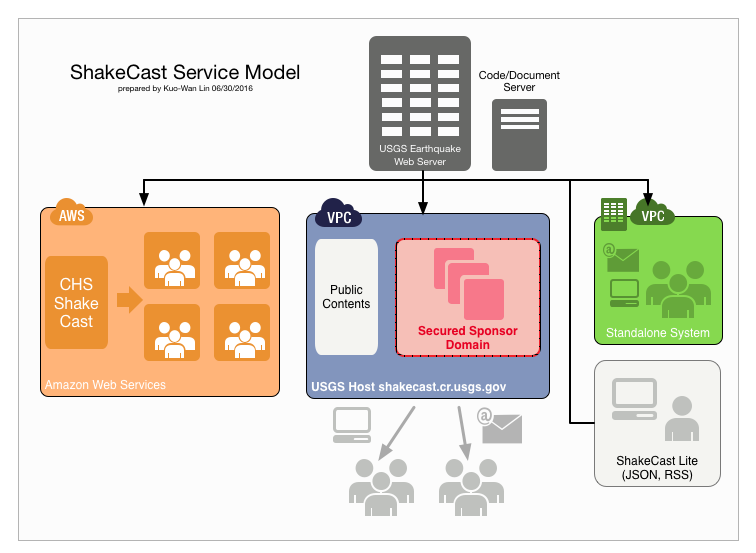

# ShakeCast Service Model

ShakeCast comes in two distinctly different applications, Standalone ShakeCast and ShakeCast Lite.
ShakeCast Cloud is an application hosting service for the full ShakeCast system by the Amazon Web Services. A comparison of three service models is shown below.

.

