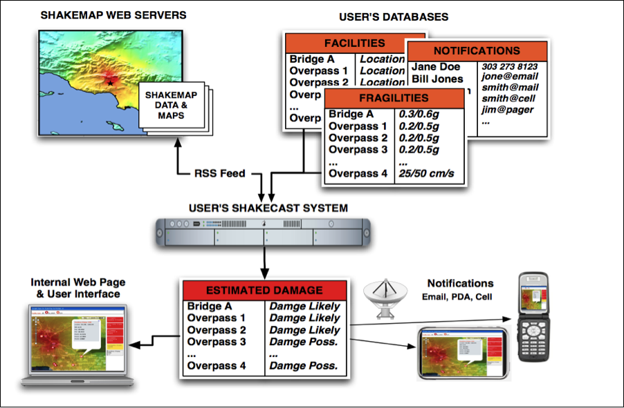
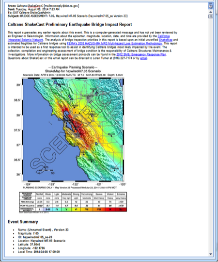
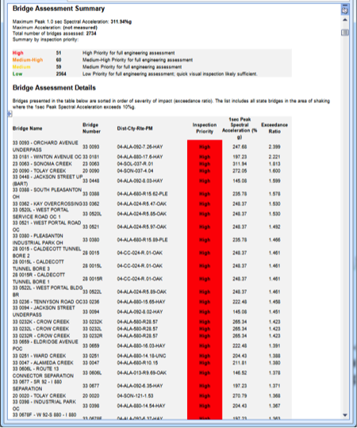
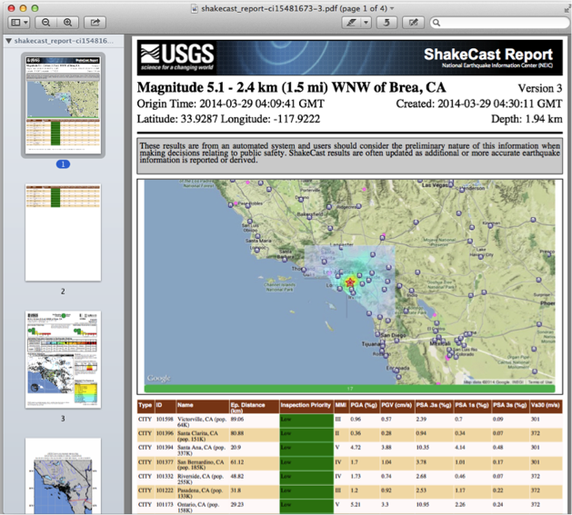
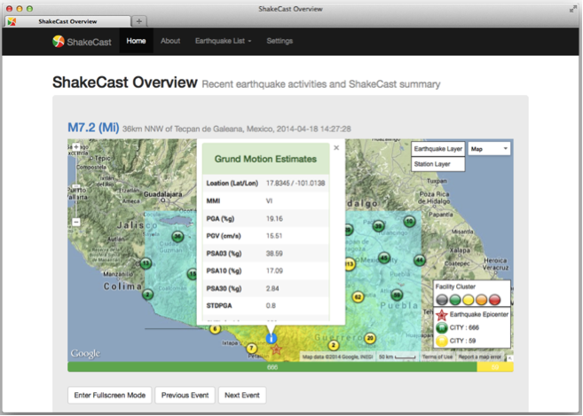
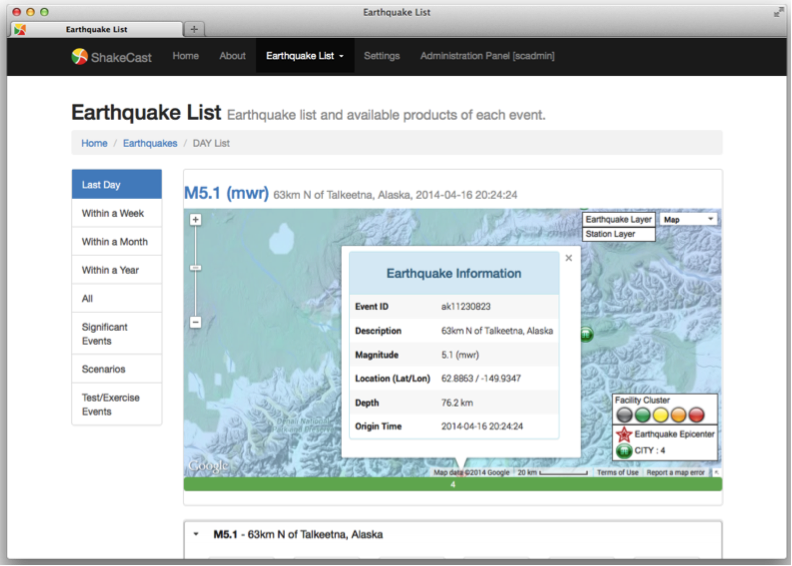
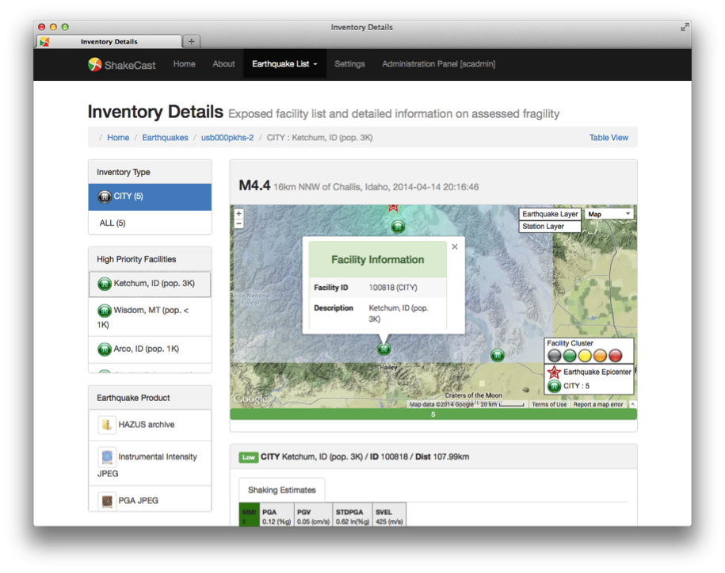
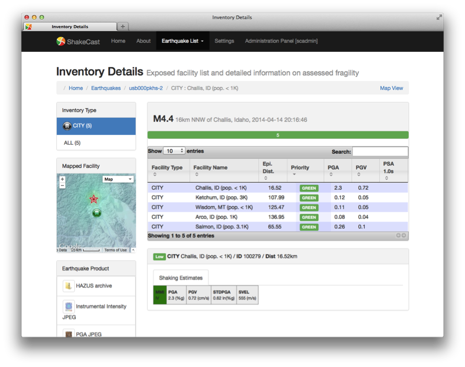
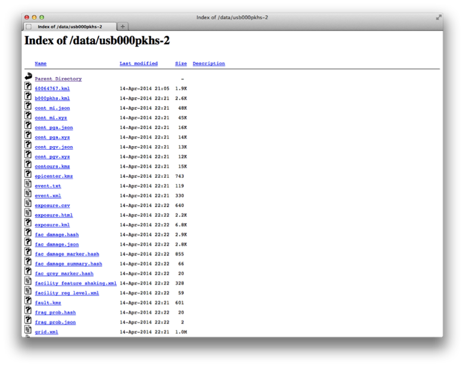

# ShakeCast V3 User Guide

This guide is intended for ShakeCast V3 users. This guide is for you if you are using ShakeCast notifications, facility assessment or inspection reports, or the ShakeCast website.

If you are installing, operating or configuring a ShakeCast system, see details in the [**ShakeCast V3 Operator's Technical Guide**](https://my.usgs.gov/confluence/display/ShakeCast/).

## 1 ShakeCast User Guide: Introduction
Welcome ShakeCast Subscribers and Emergency Managers!

ShakeCast is a web-based application that automatically retrieves earthquake shaking data and estimates from the USGS and analyzes it against your facilities' shaking vulnerability (structural fragility parameters). ShakeCast generates inspection priority (or facility damage ranking) messages and other event products for use by emergency responders within minutes of an event. ShakeCast notifications and products provide timely information to responders that raise situational awareness and facilitate more informed decision-making.  

ShakeCast messages are sent to users for earthquakes exceeding an organization-specified magnitude and geographic area. For earthquakes where ground-shaking levels are significant enough to have potential impact to facilities, a "FACILITY ASSESSMENT" email will be sent with a summary of facility inspection priorities (or potential damage), typically within 5-10 minutes of an earthquake.

ShakeCast delivers post-earthquake products including:

* Facility Assessment Email 
* ShakeCast Summary Reports (facility assessment or inspection reports)
* User's ShakeCast Website: email notifications will contain a link to your organization's ShakeCast website with more ShakeCast products, e.g., Google Earth KML, ArcGIS, Excel files, and others
* ShakeMap: Map showing the distribution of strong shaking regions

ShakeCast automatically determines the shaking value at a facility. Organizations set threshold notification levels for alerts (typically green, yellow, and red) for each facility and then automatically notify (via pager, text to a cell phone, and/or email) individuals responsible for those specific facilities to prioritize inspection and response.

Note: The term "alert level" rather than "damage level" is used because of the sensitivity of the latter term, and to the reality that estimated damage is an uncertainty statistical estimate, not an actual site-specific evaluation. Users can label the alert levels with such terms as "inspection priority", "concern level", and "damage likelihood;" the specific choice can be redefined by an organization.

## 2 Facility Assessment Email
Facility shaking evaluation messages are sent if the earthquake generates shaking at any facility located within the shaking zone above pre-selected shaking values. The email includes: 

* **Earthquake Information**: Epicenter, magnitude, date, time and location
* **Facility Assessment Summary**: Count of facilities within the shaken region by inspection priority (e.g., categorized RED, ORANGE, YELLOW, and GREEN, corresponding to high, moderate, low, and very low inspection priority or potential damage). Regulatory exceedance evaluations can be provided, if configured. 
* **Facility Assessment Details**: List of specific facilities within the strongly shaken regions, sorted by inspection priority.
* **ShakeCast Summary Report**: Attached as a PDF.

Figure 1. ShakeCast Facility Assessment message and contents.

## 3 ShakeCast Summary Report (PDF)
ShakeCast immediately generates a Facility Assessment or Inspection
(PDF) Summary Report. This is the signature product of the ShakeCast system and is typically included as an attachment to the Facility Assessment email. An optional onePAGER summary page and an optional DYFI (Did You Feel It?) map page can be included, depending on availability.

### 3.1 ShakeCast Summary Report

* **Earthquake parameters**: Origin time, magnitude, hypocenter, and the name of the earthquake region.
* **Map**: A ShakeMap intensity overlay showing the regional extent of shaking, the facilities and recent seismicity within the region. A bar at the bottom of the map shows color-coded impact/inspection priority levels and the number of facilities in each level.
* **Inspection Priority Table**: Detailed parameters for each assessed facility. The template-driven table fields are customizable, but can include: facility name, distance from epicenter, location, inspection priority, regulatory exceedance, and metric values: e.g., PGA, PGV, PSA .3s, PSA 1s, PSA 3s.  

## 4 Navigating the ShakeCast Web Portal
The information on the ShakeCast web portal supplements email notification information in an interactive, responsive web-based environment, primarily for system administration and for more detailed analyses of facilities, fragilities and their impact due to past, present and future earthquakes (scenarios).
### 4.1 Home Page - ShakeCast Overview
After a successful login, the ShakeCast home page displays:

* An interactive earthquake map, centered on the most recent event with the ShakeMap overlay, providing access to ShakeCast results for the selected event.
* Tabs to access Earthquake lists (past, present, future) and ShakeCast settings and configurations. 

After selection of an earthquake of interest, users can see and access: 

* Key earthquake parameters.
* Number of facilities evaluated summarized by alert level.
* Interactive access to detailed facility tables including shaking level, inspection priority and other metrics, as well as the fragility values used in its evaluation. 
* Links to earthquake-specific USGS event-related products.

The interactive map supports standard Google Maps controls. In addition to the ShakeMap intensity overlay, three custom image layers are available including: recent earthquakes, facility inventory, and seismic stations. The same interactive map is available throughout the web site with some customizations for the target pages. The default home page will automatically refresh the list of earthquakes.

Clicking within the ShakeMap overlay will provide a pop-up window indicating the estimated ground shaking levels at the location of mouse click, as shown in the figure above.

To enter the display mode, click the "Enter Fullscreen Mode" button. This mode works in with user-defined settings to animate recent earthquakes and display supplemental previous seismicity, facility and station information. 

### 4.2 Earthquake Pages

#### 4.2.1 Earthquake List: Recent Events, Significant Events, Scenarios

The "Earthquake List" left-navigation panel links to earthquakes based on recency, significance, and purpose. The ShakeCast system automatically performs daily maintenance of the earthquake database and earthquakes without facility exposure will be removed from the system once they age out of the user-defined time window. The administrator can override the default behavior and manage events in the earthquake database.

* **Daily, Weekly, Monthly, Yearly and All**: Earthquakes within the specified time period. 
* **Significant Events**: Significant earthquakes processed by the ShakeCast system that are above the archive magnitude and with facility exposure.
* **Scenarios**: Displays earthquake scenarios downloaded from the USGS ShakeMap web site or converted from processed actual events.
* **Test/Exercise Events**: Displays actual and scenario earthquakes converted for the purpose of local testing or exercises.

#### 4.2.2 Earthquake List Table
The selected earthquake catalog is presented in both an interactive map and interactive tabbed list. Click on the earthquake tab to show products available for each specific event.

The system is pre-configured to display the following products (available products can be modified by the administrator):

* **ShakeCast Page**:  Link to ShakeCast detailed earthquake page.
* **ShakeMap Map Image**:  Link to ShakeMap ground shaking maps of different metrics, including MMI, PGA, PGV, and optional PSA at 0.3, 1.0, and 3.0 seconds.
* **ShakeMap Information**: Link to "info.xml" showing detailed information on ShakeMap input data, processing parameters, and output products.
* **ShakeCast Products**: Link to PDF summary reports and KML for viewing with the Google Earth program.

#### 4.2.3 Inventory Details Page
Navigate to the Inventory Details page by either clicking the "ShakeCast Page" icon or the hyperlinked event name above the map in the Earthquake List page.

The ShakeCast event page shows the complete facility inventory assessed for the selected earthquake. The notification email messages users receive often are a subset of the entire inventory, depending on their type, geographic coverage, and triggering threshold.

The event page aggregates facilities of different types to provide a comprehensive view of all facilities evaluated for the earthquake. The left-navigation panel has three displays: inventory type list, high priority facility list, and earthquake product list.  The inventory type list filters the master facility list based on the selected facility type and updates the high priority list accordingly. 

Select the facility in the facility list or via the interactive map to display detailed ground shaking estimates, potential damage state probabilities, and facility-specific attributes and assessment results. 

The interactive map interface facilitates a simple inspection tool (right-mouse click) to display shaking estimates at a point location or to select a facility for detailed interrogation.

The inventory details page in table view is shown below. On this page, each facility type is presented in an interactive paginated table. The facility table can be sorted by individual parameters and be searched to refine the catalog.  Select the facility in the facility list to display the same detailed ground shaking estimates, potential damage state probabilities, and facility-specific attributes and assessment results as shown in the inventory details page.

### 4.3 Scenarios

Earthquake Scenarios describe the expected ground motions and effects of specific hypothetical large earthquakes. In planning and coordinating emergency response, utilities, emergency responders and other agencies are best served by conducting training exercises based on realistic earthquake situations, ones they are most likely to face. 

Earthquake scenarios are not earthquake predictions. No one knows in advance when or how large a future earthquake will be. However, by making assumptions about the size and location of a hypothetical future earthquake, we can make reasonable estimates of the effects of the assumed earthquake, particularly the way the ground will shake. The anticipation of the potential shaking effects is the main benefit of the earthquake scenario for planning and preparedness purposes.

Scenario events are available from the USGS Earthquake Hazards Program [ShakeMap website](http://earthquake.usgs.gov/earthquakes/shakemap/list.php?x=1&s=1).

### 4.4 Full Earthquake Product

ShakeCast archives all versions of ShakeMaps received by the system and products generated locally, but does not include archives of other USGS (non-ShakeMap) earthquake products. As shown in the figure below, the page contains a list of all available ShakeCast files for the specific event and version, including various ShakeMap image files, and the core data files used in the ShakeCast analysis routines. The full list products and metadata available combining both ShakeMap and ShakeCast processes can be up to 100 files. Access to the full product web page is not recommended except for expert users who are familiar with both applications. Detailed descriptions of ShakeMap and its products are documented in the ShakeMap Manual (Wald et al., 2005) or under the "downloads" tab any earthquake's ShakeMap web page.  

### 4.5 User Settings
End users can customize their own settings of how earthquake information is presented. The user's web browser saves the user settings locally.  Modifiable settings include:

* **User Credentials**: user credential information is used to dynamically retrieve information from the ShakeCast web server. Users should only save credential information on their private computers.
* **Map Layers**: Specifies displayed layers of maps, location and controls.
* **ShakeMap List**: Specifies how the earthquake list is refreshed and displayed.  This setting is mainly used for the default homepage.
* **Facility List**: Specifies the list and behavior of facilities displayed in the interactive map.

## 5 Installing and Running ShakeCast
ShakeCast is free, open source and can run on a local virtual machine (Windows or Linux) or in the cloud on an Amazon Web Services (AWS) Linux instance.

In advance of installing ShakeCast, an organization needs to make decisions and collect the following information and data:

* **USERS**: The organization needs a list of notification recipients with user email and/or phone numbers (for messaging).
* **GROUPS**: Users are grouped by the circumstances the under which alerts are sent (e.g., magnitude, damage "possible" at specific facilities) and the geographic region for notifications. 
* **FACILITIES**: Users need a list of facilities and their locations (latitude and longitude). An organization will select a ground motion metric and assign fragility thresholds (e.g., GREEN, YELLOW, ORANGE, and RED) to each structure. If facility fragilities are not well defined, organizations can use generic intensity (MMI) as a default. Custom fragilities are recommended but often take earthquake engineering guidance. 

ShakeCast provides ground motion estimates in different formats, i.e., intensity (MMI as instrumentally derived seismic intensity), peak ground acceleration (PGA in %g), peak ground velocity (PGV in cm/s) or spectral response at 0.3, 1, 3 sec (PSA in %g).

### 5.1 Ground Motion Metrics 
ShakeCast provides ground motion estimates in six (6) different ShakeMap shaking intensity metrics (IMs):

* Intensity (**MMI** - instrumentally derived seismic intensities)
* Peak ground acceleration (**PGA** in %g)
* Peak ground velocity (**PGV** in cm/s)
* Spectral response acceleration at periods of 0.3, 1, 3 sec (**PSA** in %g)

An organization will use one or more of these metrics to determine an inspection priority for their structures. Typically, the selection is based on the type of engineering information available for their buildings. 

By default, ShakeCast uses the Modified Mercalli Intensity (MMI), which depicts 10 categories of shaking severity. ShakeCast groups these categories into three potential damage ranges:

**Category 1. Damage: 'Unlikely' MMI less than V (GREEN)**

| I.   | Not felt. 
| II.  | Felt by persons at rest, on upper floors, or favorably placed. 
| III. | Felt indoors. Hanging objects swing. 
| IV.  | Hanging objects swing. Windows, dishes, doors rattle. Glasses clink. In the upper range of IV, wooden walls and frame creak. 

**Category 2.  Damage: 'Possible' MMI between V and VII (YELLOW)**

| V. | Felt outdoors; direction estimated. Sleepers wakened. Small unstable objects displaced or upset.  Doors swing, close, open. 
| VI. | Felt by all. Windows, dishes, glassware broken. Knickknacks, books, etc., off shelves. Pictures off walls. Furniture moved or overturned. 
| VII. | Difficult to stand. Furniture broken. Weak chimneys broken at roof line. Fall of plaster, loose bricks, stones, tiles, cornices (also unbraced parapets and architectural ornaments). 

**Category 3.  Damage: 'Likely' - MMI greater than VII (RED)**

| VIII. | Steering of cars affected. Fall of stucco and some masonry walls. Twisting, fall of chimneys, factory stacks, monuments, towers, elevated tanks. Frame houses moved on foundations if not bolted down. 
| IX. | Frame structures, if not bolted, shifted off foundations. Serious damage to reservoirs. Underground pipes broken. 
| X. | Most masonry and frame structures destroyed with their foundations. Some well-built wooden structures and bridges destroyed. Serious damage to dams, dikes, embankments. 

The use of MMI for the default is not because intensity is a sufficient shaking IM, but rather it illustrates the goal of categorizing the potential impact to facilities into similar inspection priority or potential damage categories, but based on their fragility to the IM that best describes the response of structure to shaking. More typically, the users should describe the fragility of each structure using PGA or PSA at a particular period. 

**Exceedance Ratio**: For ShakeCast to prioritize the facilities in an ordered list, the results must be normalized. The exceedance ratio quantifies the relative priority of different buildings within the same inspection priority state. 

For example, two buildings are both classified as "YELLOW" and the organization is using the MMI scale (YELLOW=MMI values between 5-7). If Building A experiences an MMI of 6.21 and Building B MMI of 5.07, Building A is listed with a higher priority (exceedance ratio 0.605) than Building B (exceedance ratio 0.035). Exceedance ratio is computed by the difference of the estimated intensity metric minus the lower threshold of the damage range, divided by the intensity metric range in the category, e.g., (6.21-5.0)/2.0 = 0.605.

Higher ER=closer to next damage level. Low ER, closer to lower value.

## 6 ShakeCast Limitations 
Finally, some important notes about the use of ShakeCast notifications and results:

ShakeCast relies on ShakeMap for ground motion estimates and observations. ShakeMap is a model of the ground motion field for different ground motion intensity measures (IM's). The model depends on ground motion prediction equations (GMPEs), a model of the fault location for larger events, site condition maps (Vs30, typically) and interpolation between strong motion data and estimates. Each of these inputs can change with time, and ShakeMaps can be updated minutes, hours, days, or years after the earthquake as new data, input constraints, earthquake models, and interpolation methods are provided. 

ShakeCast does not report verified facility damage. The analysis uses recorded and interpolated ground shaking estimates, combined with statistical models of the structures. ShakeCast is intended to focus limited inspection resources to areas where groups of structures are more likely to have the critical combination of damaging shaking levels and more vulnerable facilities (i.e., older design-era structures). There are limitations to this type of statistical approach, and the results should be interpreted with caution.

ShakeCast does not define nor mandate a specific emergency response protocol. ShakeCast informs responders at all levels in the organization with the best available information during a time window immediately following an earthquake when information about the extent of potential damage and impacts to infrastructure are typically not well known. 
